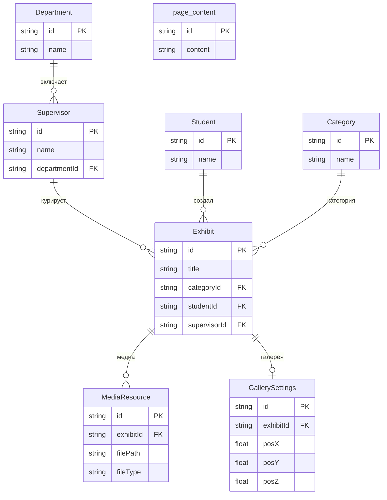

# Рисунок 2.1.1 — Связи сущностей модели данных

Ниже приведена ER-диаграмма модели данных проектируемой системы: сущности **Department**, **Supervisor**, **Student**, **Category**, **Exhibit**, **MediaResource**, **GallerySettings** и **PageContent**. Центр схемы — **Exhibit**: к нему ведут связи от Category (категория экспоната), Student (автор), Supervisor (научный руководитель); от Exhibit расходятся связи к MediaResource (медиафайлы: 3D, превью, изображения) и к GallerySettings (настройки в виртуальной галерее, связь один к одному). Supervisor связан с Department (один отдел — много руководителей). **PageContent** — сущность-синглтон для редактируемого контента страниц, связей с остальными таблицами не имеет.

Диаграмму можно вставить в пояснительную записку: скопировать блок кода в документ (Word, Google Docs не поддерживают Mermaid) или экспортировать изображение из редактора с поддержкой Mermaid (VS Code с расширением, Typora, Obsidian, GitHub, GitLab и т.п.) и вставить как рисунок.

---

## Описание схемы: что на диаграмме и как это устроено

ER-диаграмма — это наглядный план базы данных: какие сущности (таблицы) есть, какие у них поля и как они связаны. Для раздела про разработку модели данных она по сути фундамент.

**Общая картина.** На схеме — модель данных приложения для управления экспонатами виртуальной галереи ВГУ. Сущности: **Department** (кафедры), **Supervisor** (научные руководители), **Student** (студенты-авторы), **Category** (категории экспонатов), **Exhibit** (экспонаты), **MediaResource** (медиафайлы экспоната: 3D, превью, изображения), **GallerySettings** (настройки экспоната в виртуальной галерее), **PageContent** (контент статических страниц сайта).

**Department (кафедра).** *id* (uuid, PK), *name*. Связь с Supervisor — «один ко многим»: одна кафедра включает много руководителей; в Supervisor — поле *departmentId* (FK на Department).

**Supervisor (научный руководитель).** *id* (uuid, PK), *name*, *position*, *rank*, *departmentId* (FK на Department). Связь с Exhibit — «один ко многим»: один куратор курирует много экспонатов; в Exhibit — поле *supervisorId* (FK на Supervisor).

**Student (студент).** *id* (uuid, PK), *name*, *course*, *groupCode*. Связь с Exhibit — «один ко многим»: один студент может быть автором многих экспонатов; в Exhibit — поле *studentId* (FK на Student).

**Category (категория).** *id* (uuid, PK), *name* (уникальное). Связь с Exhibit — «один ко многим»: одна категория объединяет много экспонатов; в Exhibit — поле *categoryId* (FK на Category).

**Exhibit (экспонат).** Центральная сущность. Поля: *id* (uuid, PK), *inventoryNumber* (уникальный), *title*, *description*, *fullDescription*, *creationDate*, *categoryId* (FK на Category), *studentId* (FK на Student), *supervisorId* (FK на Supervisor), *dimensions*, *currentLocation*, *isPublic*, *technicalSpecs*, *interestingFacts* (JSON-строки), *createdAt*, *updatedAt*. К экспонату привязаны категория, автор, руководитель, а также записи в MediaResource и не более одной записи в GallerySettings.

**MediaResource (медиафайл).** *id* (uuid, PK), *exhibitId* (FK на Exhibit), *filePath*, *fileType* (image | video | model), *isPrimary* (превью). Связь с Exhibit — «много к одному»: у одного экспоната может быть несколько медиазаписей (3D-модель, превью, дополнительные изображения). В БД хранятся только пути к файлам; сами файлы лежат в файловой системе.

**GallerySettings (настройки в галерее).** *id* (uuid, PK), *exhibitId* (FK на Exhibit, уникальный — связь один к одному), *posX*, *posY*, *posZ*, *scale*, *rotY*, *visibleInGallery*. Позиция, масштаб и видимость экспоната в 3D-сцене виртуальной галереи.

**PageContent.** Контент редактируемых страниц: *id* (PK, по умолчанию «singleton»), *content*, *updatedAt*. Отдельно от экспонатов и кураторов, связей с ними нет.

**Итог.** Exhibit в центре: к нему сходятся связи от Category, Student, Supervisor; от Exhibit — к MediaResource и GallerySettings. Department связан с Supervisor. PAGE_CONTENT стоит особняком. Схема соответствует фактической Prisma-модели в проекте.

---

## Вариант 1: Mermaid (полная схема — все сущности и поля)

```mermaid
erDiagram
  Department {
    string id PK
    string name
  }

  page_content {
    string id PK
    string content
    datetime updatedAt
  }

  Supervisor {
    string id PK
    string name
    string position
    string rank
    string departmentId FK
  }

  Student {
    string id PK
    string name
    int course
    string groupCode
  }

  Category {
    string id PK
    string name UK
  }

  Exhibit {
    string id PK
    string inventoryNumber UK
    string title
    string description
    string fullDescription
    string creationDate
    string categoryId FK
    string studentId FK
    string supervisorId FK
    string dimensions
    string currentLocation
    boolean isPublic
    string technicalSpecs
    string interestingFacts
    datetime createdAt
    datetime updatedAt
  }

  MediaResource {
    string id PK
    string exhibitId FK
    string filePath
    string fileType
    boolean isPrimary
  }

  GallerySettings {
    string id PK
    string exhibitId FK_UK
    float posX
    float posY
    float posZ
    float scale
    float rotY
    boolean visibleInGallery
  }

  Department ||--o{ Supervisor : "включает"
  Supervisor ||--o{ Exhibit : "курирует"
  Student ||--o{ Exhibit : "создал"
  Category ||--o{ Exhibit : "классифицирован"
  Exhibit ||--o{ MediaResource : "имеет файлы"
  Exhibit ||--o| GallerySettings : "настройки сцены"
```

---

## Вариант 2: Mermaid (упрощённая диаграмма — только сущности и связи)

Если в ПЗ нужна более компактная схема без перечисления полей:



**Обозначения связей:**
- `Department ||--o{ Supervisor` — одна кафедра включает ноль или много руководителей.
- `Supervisor ||--o{ Exhibit` — один руководитель курирует ноль или много экспонатов; у экспоната *supervisorId* → Supervisor.id (onDelete: SetNull).
- `Student ||--o{ Exhibit` — один студент создал ноль или много экспонатов; *studentId* → Student.id (onDelete: SetNull).
- `Category ||--o{ Exhibit` — одна категория у многих экспонатов; *categoryId* → Category.id (onDelete: SetNull).
- `Exhibit ||--o{ MediaResource` — у экспоната много медиазаписей; при удалении экспоната записи удаляются (Cascade).
- `Exhibit ||--o| GallerySettings` — у экспоната не более одной записи настроек галереи (1:1); *exhibitId* уникален.

---

## Как получить изображение для вставки в Word/ПЗ

1. **Онлайн:** зайти на [mermaid.live](https://mermaid.live), вставить код из варианта 1 или 2, нажать Export → PNG/SVG и сохранить файл. Вставить в документ как рисунок.
2. **VS Code:** установить расширение "Markdown Preview Mermaid Support" или "Mermaid Editor", открыть этот .md файл, предпросмотр отобразит диаграмму; скриншот или экспорт в изображение.
3. **Typora / Obsidian:** открыть файл — диаграмма отрендерится; экспорт в PDF или копирование как изображение.

После экспорта подписать рисунок в ПЗ: **«Рисунок 2.1.1 — Связи сущностей модели данных»**.
