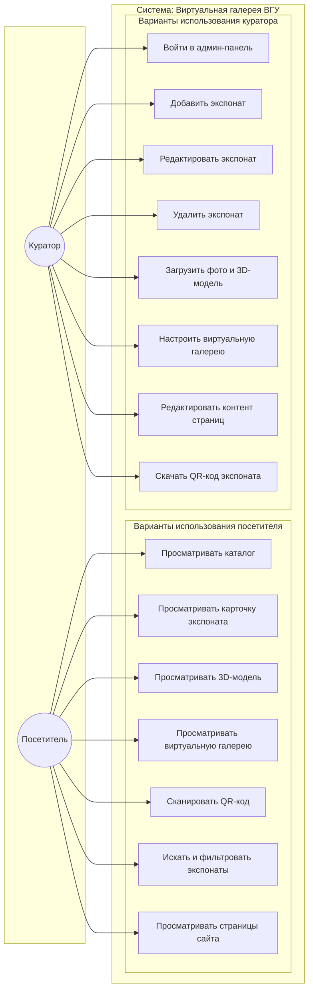
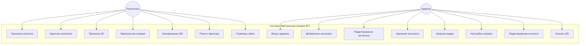

# Рисунок — Диаграмма вариантов использования (Use Case)

Диаграмма вариантов использования отражает, кто взаимодействует с системой и какие сценарии (варианты использования) при этом выполняются. В проекте выделены два основных актора: **Посетитель** (гость выставки, студент, абитуриент) и **Куратор** (сотрудник факультета, администратор фонда). Система — веб-приложение виртуальной галереи ВГУ: каталог экспонатов, карточки с описанием и 3D, виртуальная галерея, QR-коды, админ-панель для учёта и редактирования контента.

---

## Диаграмма (Mermaid)

При необходимости более компактного вида можно использовать вариант без подгрупп (все сценарии в одной рамке системы):

---

## Краткое описание вариантов использования

| Актор      | Вариант использования              | Описание |
|------------|------------------------------------|----------|
| Посетитель | Просматривать каталог              | Список экспонатов с превью, пагинация. |
| Посетитель | Искать и фильтровать экспонаты     | Поиск по тексту, фильтр по категории, году, «только с 3D». |
| Посетитель | Просматривать карточку экспоната   | Название, описание, автор, научрук, галерея фото, интерактивная 3D-модель при наличии. |
| Посетитель | Просматривать 3D-модель             | Встроенный просмотр GLB/GLTF в браузере на карточке экспоната. |
| Посетитель | Просматривать виртуальную галерею   | 3D-сцена в браузере, экспонаты расставлены в пространстве; переход к карточке по клику. |
| Посетитель | Сканировать QR-код                 | Страница «Сканер»: камера устройства, распознавание QR и переход на карточку экспоната. |
| Посетитель | Просматривать страницы сайта       | Главная, «О проекте» и др. — статический и редактируемый контент. |
| Куратор    | Войти в админ-панель               | Аутентификация (логин/пароль), доступ к разделам экспонатов и контента. |
| Куратор    | Добавить экспонат                  | Заполнение полей (название, описание, автор, научрук, категория и т.д.), привязка медиа. |
| Куратор    | Редактировать экспонат             | Изменение данных и медиа существующего экспоната. |
| Куратор    | Удалить экспонат                   | Удаление записи экспоната из системы. |
| Куратор    | Загрузить фото и 3D-модель         | Загрузка превью, галереи изображений и файла 3D-модели (GLB/GLTF) к экспонату. |
| Куратор    | Настроить виртуальную галерею      | Редактор сцены: расстановка экспонатов (позиция, масштаб, поворот), видимость в галерее. |
| Куратор    | Редактировать контент страниц      | Правка текстов главной страницы, «О проекте» и др. без изменения кода. |
| Куратор    | Скачать QR-код экспоната           | Формирование и скачивание QR-кода, ведущего на карточку экспоната, для печати и размещения в зале. |

---

## Как получить изображение для вставки в ПЗ

1. **Онлайн:** [mermaid.live](https://mermaid.live) — вставить код первой или второй диаграммы, Export → PNG/SVG.
2. **VS Code:** расширение для Mermaid, предпросмотр .md файла — скриншот или экспорт.
3. **Typora / Obsidian:** открыть файл, экспорт в PDF или копирование диаграммы как изображение.

Подпись в пояснительной записке: **«Рисунок — Диаграмма вариантов использования системы виртуальной галереи ВГУ»** (или по нумерации раздела, например 2.2.X).
