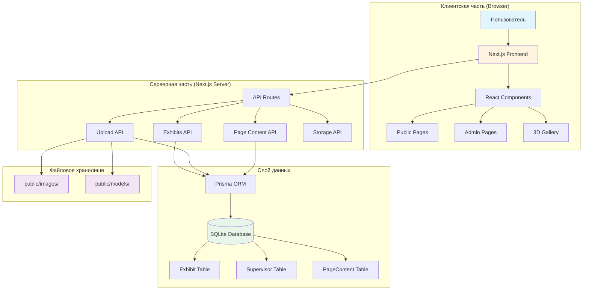
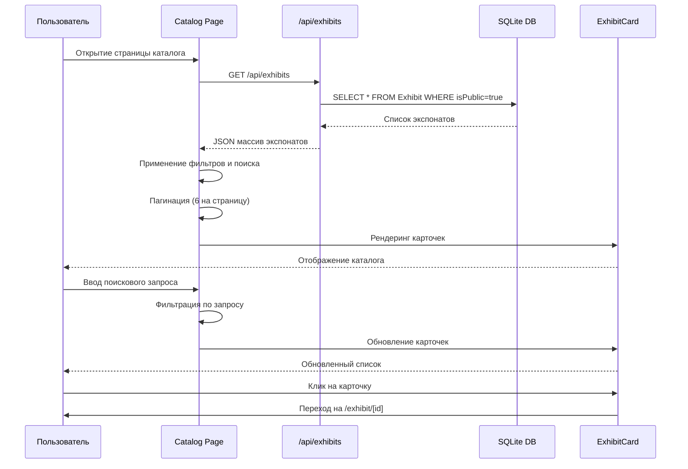
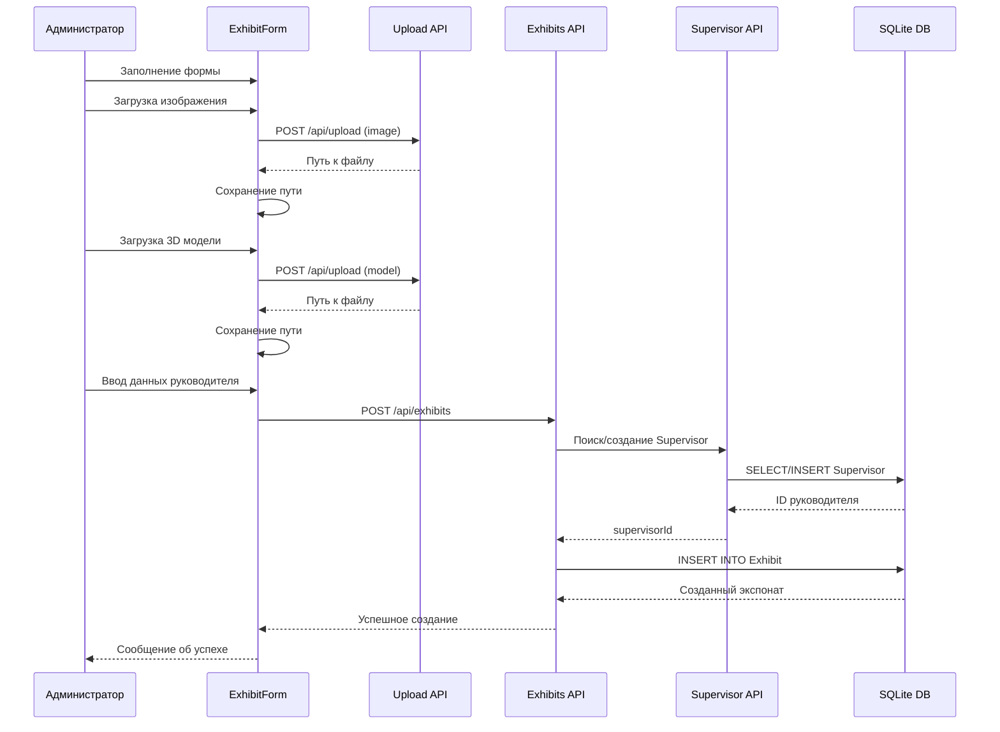
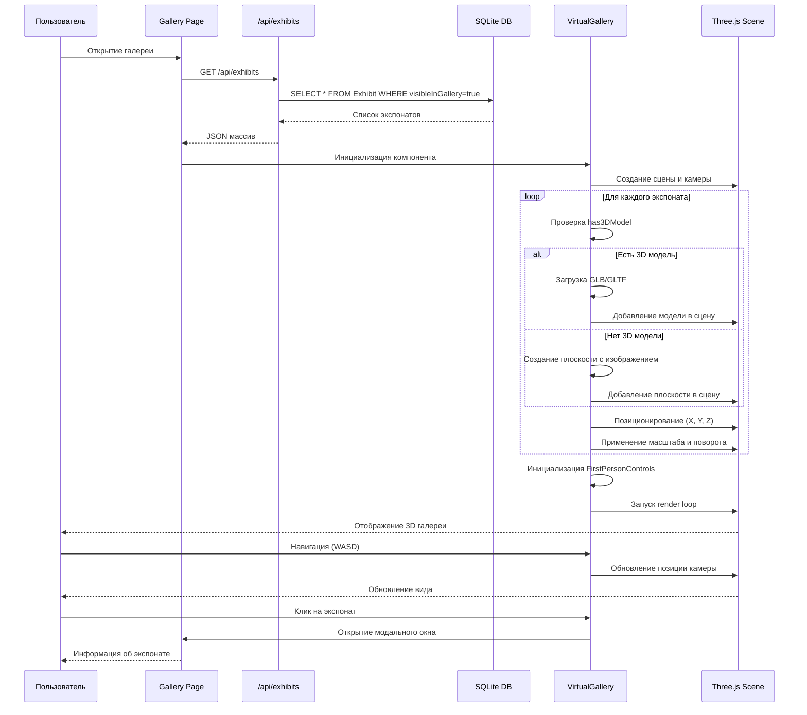
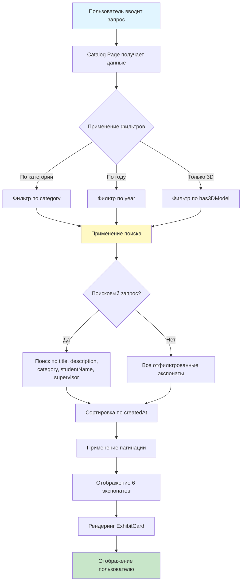
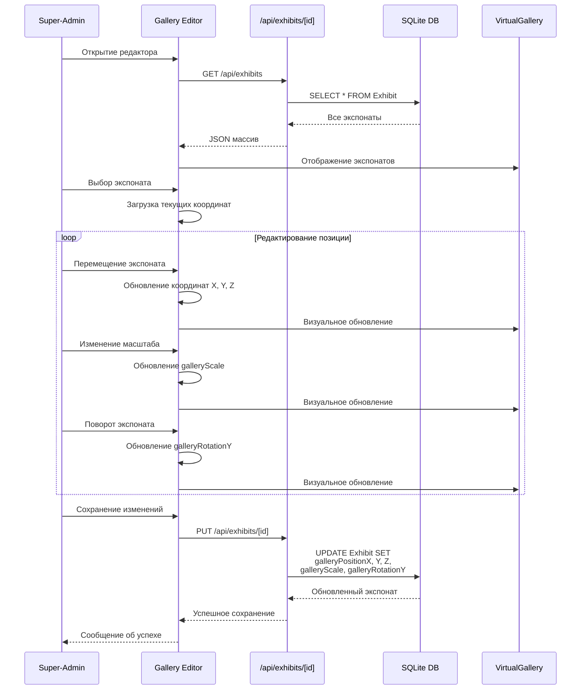
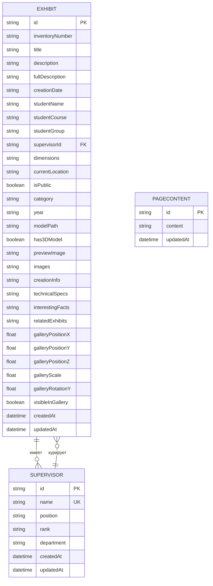
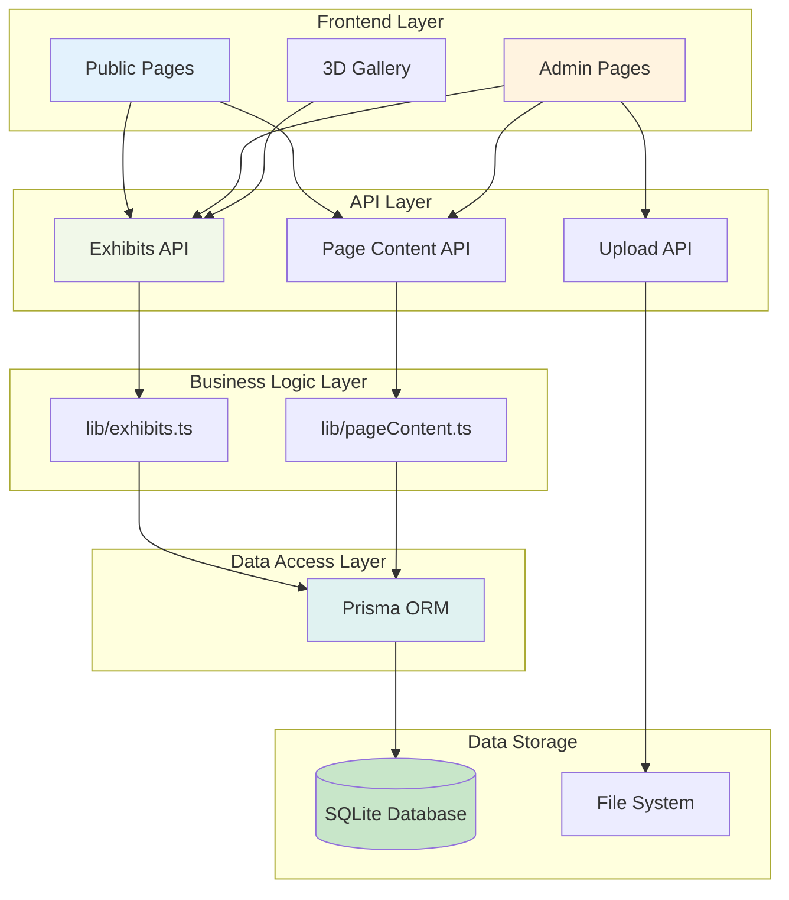

# Диаграммы архитектуры системы

## 1. Общая архитектурная схема системы



## 2. Диаграмма компонентов и модулей

```mermaid
graph LR
    subgraph "Публичный модуль"
        A1[Главная страница<br/>app/page.tsx]
        A2[Каталог<br/>app/catalog/page.tsx]
        A3[Страница экспоната<br/>app/exhibit/[id]/page.tsx]
        A4[Виртуальная галерея<br/>app/gallery/page.tsx]
        A5[О проекте<br/>app/about/page.tsx]
    end
    
    subgraph "Административный модуль"
        B1[Админ-панель<br/>app/admin/page.tsx]
        B2[Редактор галереи<br/>app/admin/gallery/page.tsx]
        B3[Сканер QR<br/>app/camera/page.tsx]
    end
    
    subgraph "API модуль"
        C1[Exhibits API<br/>/api/exhibits]
        C2[Upload API<br/>/api/upload]
        C3[Page Content API<br/>/api/page-content]
        C4[Storage API<br/>/api/storage]
    end
    
    subgraph "Компоненты"
        D1[Navbar<br/>Footer]
        D2[ExhibitCard<br/>SafeImage]
        D3[VirtualGallery<br/>ModelViewer]
        D4[ExhibitForm<br/>ExhibitList]
        D5[FirstPersonControls<br/>MobileControls]
    end
    
    subgraph "Библиотеки"
        E1[lib/exhibits.ts]
        E2[lib/pageContent.ts]
        E3[lib/prisma.ts]
    end
    
    A1 --> D1
    A2 --> D2
    A3 --> D3
    A4 --> D3
    A4 --> D5
    B1 --> D4
    B2 --> D3
    B3 --> D1
    
    A2 --> C1
    A3 --> C1
    A4 --> C1
    B1 --> C1
    B1 --> C2
    B2 --> C1
    B3 --> C1
    
    C1 --> E1
    C3 --> E2
    E1 --> E3
    E2 --> E3
    
    style A1 fill:#e3f2fd
    style A2 fill:#e3f2fd
    style A3 fill:#e3f2fd
    style A4 fill:#e3f2fd
    style B1 fill:#fff3e0
    style B2 fill:#fff3e0
    style C1 fill:#f1f8e9
    style C2 fill:#f1f8e9
    style D1 fill:#fce4ec
    style E1 fill:#e0f2f1
```

## 3. Диаграмма потоков данных

### 3.1 Поток данных при просмотре каталога



### 3.2 Поток данных при создании экспоната



### 3.3 Поток данных в виртуальной галерее



### 3.4 Поток данных при поиске и фильтрации



### 3.5 Поток данных при редактировании позиции в галерее



## 4. Диаграмма структуры базы данных



## 5. Диаграмма взаимодействия модулей



## Описание диаграмм

### Общая архитектурная схема

Схема показывает трехуровневую архитектуру системы: клиентская часть (браузер с Next.js Frontend), серверная часть (Next.js Server с API Routes) и слой данных (Prisma ORM и SQLite Database). Также показано файловое хранилище для медиа-контента.

### Диаграмма компонентов и модулей

Диаграмма демонстрирует структуру приложения, разделенную на публичный модуль, административный модуль, API модуль, компоненты и библиотеки. Показаны связи между компонентами и их использование в различных частях приложения.

### Диаграмма потоков данных

Диаграммы потоков данных описывают последовательность операций для ключевых сценариев использования: просмотр каталога, создание экспоната, работа виртуальной галереи, поиск и фильтрация, редактирование позиции в галерее. Каждая диаграмма показывает взаимодействие между компонентами системы и передачу данных.

### Диаграмма структуры базы данных

ER-диаграмма показывает структуру базы данных с тремя основными таблицами: Exhibit, Supervisor и PageContent. Показаны связи между таблицами, основные поля и типы данных.

### Диаграмма взаимодействия модулей

Диаграмма демонстрирует слоистую архитектуру приложения с разделением на Frontend Layer, API Layer, Business Logic Layer, Data Access Layer и Data Storage. Показаны направления взаимодействия между слоями.
