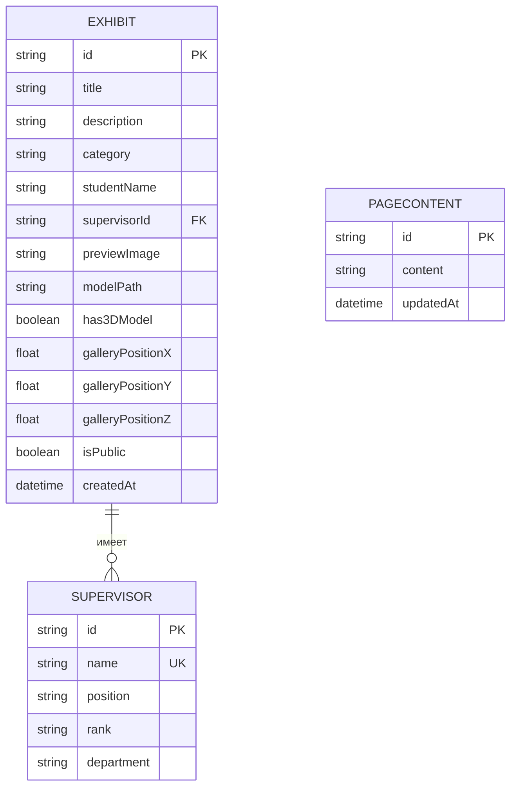
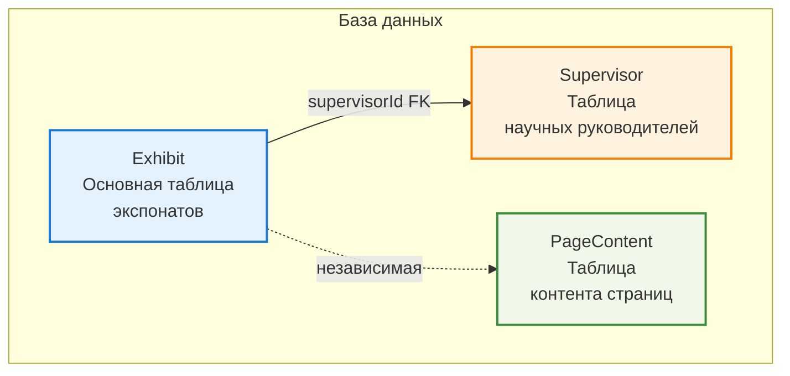

# Разработка модели данных

Проектирование базы данных осуществлялось с учетом требований нормализации до третьей нормальной формы (3NF) для обеспечения целостности данных, устранения избыточности и оптимизации производительности запросов. Модель данных разрабатывалась последовательно: от концептуальной модели, отражающей сущности предметной области, до логической модели, реализованной в виде реляционной схемы базы данных.

## Концептуальная модель данных

Концептуальная модель представляет основные сущности предметной области и связи между ними. В системе выделены три основные сущности: Exhibit (Экспонат), представляющая студенческую работу, Supervisor (Научный руководитель), представляющая преподавателя-руководителя, и PageContent (Контент страниц), предназначенная для хранения редактируемого текстового контента сайта.

Связь между сущностями Exhibit и Supervisor реализована как связь "многие-к-одному" (Many-to-One), где один научный руководитель может курировать множество экспонатов, а каждый экспонат имеет одного научного руководителя опционально. Эта связь обеспечивает целостность данных и устраняет транзитивные зависимости.

## Логическая модель данных

Логическая модель реализована в виде реляционной схемы базы данных SQLite с использованием Prisma ORM. Схема базы данных состоит из трех основных таблиц, каждая из которых отвечает за хранение определенного типа данных.

### Таблица Exhibit

Основная таблица для хранения информации об экспонатах. Структура таблицы включает следующие группы полей:

**Идентификационные поля:** `id` (первичный ключ, UUID), `inventoryNumber` (инвентарный номер фонда/музея), `title` (название экспоната, обязательное поле).

**Описательные поля:** `description` (краткое описание для превью/карточки, обязательное поле), `fullDescription` (полное описание: история создания, стилистика, символика), `creationInfo` (информация о создании работы).

**Классификационные поля:** `category` (категория экспоната, обязательное поле), `year` (год создания для обратной совместимости), `creationDate` (дата создания работы).

**Поля информации об авторе:** `studentName` (ФИО студента-автора), `studentCourse` (курс студента), `studentGroup` (группа студента).

**Связь с научным руководителем:** `supervisorId` (внешний ключ к таблице Supervisor, опциональный).

**Технические характеристики:** `dimensions` (размеры: ВхШхГ или диаметр), `currentLocation` (текущее местонахождение: экспозиция, запасник).

**Медиа-контент:** `previewImage` (путь к превью-изображению), `images` (JSON-массив путей к изображениям галереи), `modelPath` (путь к 3D модели в формате GLB/GLTF), `has3DModel` (флаг наличия 3D модели).

**Позиционирование в галерее:** `galleryPositionX`, `galleryPositionY`, `galleryPositionZ` (координаты в трехмерном пространстве), `galleryScale` (масштаб экспоната, по умолчанию 1.0), `galleryRotationY` (поворот экспоната по оси Y, по умолчанию 0), `visibleInGallery` (видимость в виртуальной галерее).

**Метаданные:** `isPublic` (флаг публичности экспоната, по умолчанию true), `createdAt` (дата создания записи), `updatedAt` (дата последнего обновления).

**Дополнительные JSON-поля:** `technicalSpecs` (технические характеристики в формате JSON-объекта), `interestingFacts` (интересные факты в формате JSON-массива), `relatedExhibits` (связанные экспонаты в формате JSON-массива).

### Таблица Supervisor

Таблица для хранения информации о научных руководителях. Выделена в отдельную таблицу для соответствия требованиям третьей нормальной формы и устранения транзитивных зависимостей.

**Структура таблицы:** `id` (первичный ключ, UUID), `name` (ФИО научного руководителя, уникальное поле), `position` (должность), `rank` (звание), `department` (кафедра), `createdAt` (дата создания записи), `updatedAt` (дата последнего обновления).

Связь с экспонатами реализована через отношение один-ко-многим: один руководитель может курировать множество экспонатов.

### Таблица PageContent

Таблица для хранения редактируемого контента страниц сайта. Имеет упрощенную структуру: `id` (первичный ключ, всегда "singleton"), `content` (JSON-структура с контентом страниц), `updatedAt` (дата последнего обновления).

## Индексы базы данных

Для оптимизации производительности запросов созданы индексы на следующих полях:

**Таблица Exhibit:**
- `category` — для быстрого поиска и фильтрации по категориям
- `year` — для фильтрации по годам создания
- `studentName` — для поиска по автору
- `supervisorId` — для связи с таблицей Supervisor и быстрого поиска экспонатов по руководителю
- `visibleInGallery` — для фильтрации экспонатов, отображаемых в виртуальной галерее
- `isPublic` — для фильтрации публичных экспонатов

**Таблица Supervisor:**
- `name` (уникальный индекс) — для быстрого поиска по имени и обеспечения уникальности

## Нормализация базы данных

База данных приведена к третьей нормальной форме (3NF) путем устранения транзитивных зависимостей. Информация о научных руководителях, включающая должность, звание и кафедру, вынесена в отдельную таблицу Supervisor, так как эти атрибуты зависят от самого руководителя, а не напрямую от экспоната.

### Преимущества нормализации

Нормализация до 3NF обеспечивает следующие преимущества:

**Устранение дублирования данных:** когда один руководитель курирует множество экспонатов, его данные хранятся только один раз в таблице Supervisor, а не повторяются в каждой записи экспоната.

**Устранение аномалий обновления:** изменение должности, звания или кафедры руководителя требует обновления только одной записи в таблице Supervisor, а не множества записей в таблице Exhibit.

**Устранение аномалий удаления:** информация о руководителе сохраняется в базе данных даже при удалении всех связанных экспонатов, что позволяет сохранить исторические данные.

**Обеспечение целостности данных:** использование внешних ключей гарантирует, что каждый экспонат может ссылаться только на существующего руководителя, а удаление руководителя обрабатывается согласно правилам каскадного удаления (в данном случае установка supervisorId в NULL).

**Улучшение производительности:** эффективное использование индексов на внешних ключах и уникальных полях ускоряет выполнение запросов, особенно при поиске и фильтрации.

### Схема связей между таблицами

Схема демонстрирует связь между таблицами: таблица Exhibit содержит внешний ключ `supervisorId`, который ссылается на первичный ключ `id` таблицы Supervisor. Таблица PageContent является независимой и хранит контент страниц сайта.

### Структура таблицы Exhibit

```mermaid
graph TD
    A[Exhibit] --> B[Идентификация]
    A --> C[Описание]
    A --> D[Классификация]
    A --> E[Информация об авторе]
    A --> F[Связь с руководителем]
    A --> G[Медиа-контент]
    A --> H[Позиционирование в галерее]
    A --> I[Метаданные]
    
    B --> B1[id PK]
    B --> B2[inventoryNumber]
    B --> B3[title]
    
    C --> C1[description]
    C --> C2[fullDescription]
    C --> C3[creationInfo]
    
    D --> D1[category]
    D --> D2[year]
    D --> D3[creationDate]
    
    E --> E1[studentName]
    E --> E2[studentCourse]
    E --> E3[studentGroup]
    
    F --> F1[supervisorId FK]
    
    G --> G1[previewImage]
    G --> G2[images]
    G --> G3[modelPath]
    G --> G4[has3DModel]
    
    H --> H1[galleryPositionX]
    H --> H2[galleryPositionY]
    H --> H3[galleryPositionZ]
    H --> H4[galleryScale]
    H --> H5[galleryRotationY]
    H --> H6[visibleInGallery]
    
    I --> I1[isPublic]
    I --> I2[createdAt]
    I --> I3[updatedAt]
    
    style A fill:#e3f2fd,stroke:#1976d2,stroke-width:3px
    style B fill:#fff9c4
    style C fill:#fff9c4
    style D fill:#fff9c4
    style E fill:#fff9c4
    style F fill:#fff9c4
    style G fill:#fff9c4
    style H fill:#fff9c4
    style I fill:#fff9c4
```

